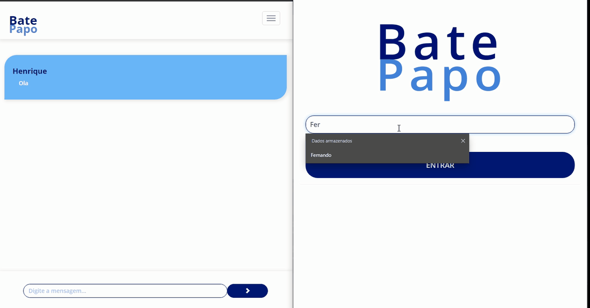

<h1 align="center">Chat</h1> 
  
Aplicação de chat utilizando o NodeJs

Mais um projetinho colocando em prática os conhecimentos de cursos e aulas. Dessa vez foi feito um chat, muito bacana, muito conhecimento, aprendi bastante coisa. Abrindo conexão com WebSocket, tendo contato com Socket.Io, e mais que tudo PRATICANDO essa tecnologia maravilhosa, Node.

<h1 align="center">
  
</h1>
<h2 align='center'> <a href="https://www.linkedin.com/feed/update/urn:li:activity:6826252078105657344/" target='_blank'>Link do projeto no Linkedin</a></h2>

<h4 align="center"> 
	🚧  Projeto ainda em construção, mas para fins didáticos está pronto 🚧
</h4>
  
